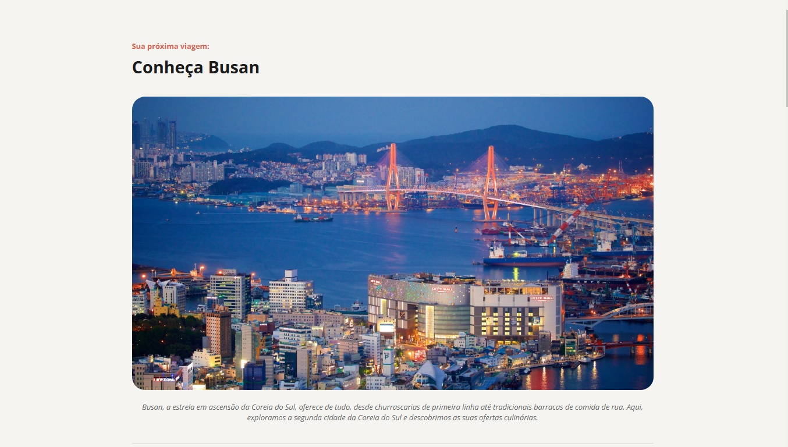

<h1 align="center" style="font-weight: bold;">Destinos - Busan </h1>

    <b>Project Description:</b>

Destinos - Busan é uma webpage interativa que destaca os principais motivos para você visitar Busan, uma das cidades mais vibrantes da Coreia do Sul! O projeto explora alguns dos lugares mais icônicos, como o Templo Haedong Yonggungsa, o Templo Beomeo-sa e o Parque Yongdusan, oferecendo uma visão inspiradora e informativa sobre o que essa cidade à beira-mar tem a oferecer.

     <a href="https://guithr.github.io/next-stop-busan/">📱 Visit this Project</a>

<h2 id="layout">Preview</h2>

    

<h2 id="technologies">💻 Technologies</h2>

- HTML, CSS: para criar uma estrutura sólida e estilizar a página.

- Design Responsivo: para garantir uma experiência de visualização impecável em diversos dispositivos.

- Style Guide: Seguindo as diretrizes fornecidas pelo layout no Figma.

<h2> Design </h2>

Este projeto faz parte de um desafio prático criado no [Figma](https://www.figma.com/community/file/1384542229391733447) e oferecido pela Rocketseat, desenvolvido do zero com o objetivo de criar uma experiência visual e funcional baseada em um protótipo de design.

